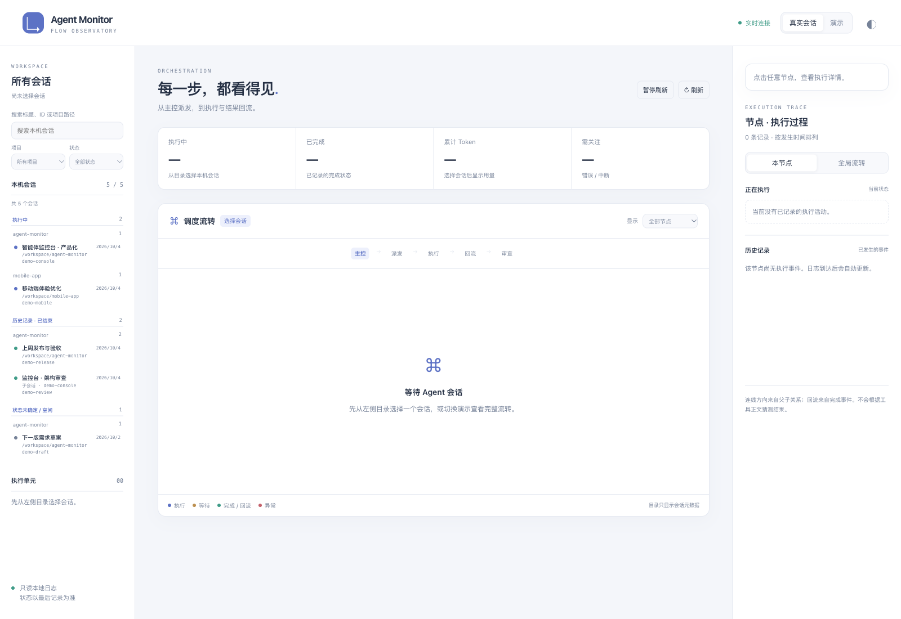

# Codex Agent Monitor

包含全会话监控中心、Codex 插件和终端 Agent 树监控脚本。支持本机 Codex 会话、独立 JSONL 事件文件及动态演示。

[安装指南](docs/install.md) · [界面截图](docs/screenshots.md) · [插件说明](plugins/agent-monitor/README.md)



截图来自本地浏览器预览，使用模拟数据。插件已声明 Codex 全局侧边栏和会话面板入口；客户端入口是否可见仍需安装后验收。

## 快速安装

需要 Codex CLI、Node.js 20+ 和 Python 3.10+。普通用户使用仓库中的预构建包，无需 npm 或手动编译。

```bash
git clone https://github.com/freetryMyleft/codexAgentMonitor.git
cd codexAgentMonitor

bash install.sh
```

安装器检查依赖、验证 SHA-256、运行服务诊断并注册独立市场。重开客户端后，在插件列表中确认启用，可引用 `@Agent Monitor` 请求“打开全会话中心”。打开后搜索并选择任意本机会话，不自动绑定当前聊天。

侧边栏入口的 `global` 声明已提供，但官方 UI 扩展说明面向 ChatGPT，当前 Codex 是否展示该入口需实际确认。安装成功不代表侧边栏已出现。若客户端未展示入口，可使用安装器打印的浏览器备用命令。详见[安装指南](docs/install.md)。

## Codex 侧边栏插件

插件源码位于 `plugins/agent-monitor/`，通过 MCP Apps 加载图形界面，并声明全局侧边栏与会话入口。展示父子关系、派发、执行、结果回流、审查、Token 明细和事件时间线；支持全会话搜索、项目与状态筛选、暂停和明暗主题。以下编译步骤仅供开发者：

```bash
cd plugins/agent-monitor
npm ci --ignore-scripts
npm run build
npm test
npm run release # 生成独立安装包

# 在仓库根目录注册本地市场并安装
cd ../..
codex plugin marketplace add "$PWD" --json
codex plugin add agent-monitor@agent-monitor-local --json
```

开发者源码安装仍可首次构建；推荐普通用户运行 `bash install.sh`，它使用 `releases/agent-monitor-1.2.0.tar.gz` 及校验文件。预构建安装包包含 MCP runtime、界面、Python 读取器、诊断与浏览器预览，不需要 node_modules 或外层仓库。

新增或更新插件可能需要重新打开客户端才能加载；实际侧边栏入口须在客户端确认，安装成功不等于已验证入口可见。本项目不会修改客户端内部文件或强制关闭客户端。

### 全会话选择

默认打开未选中的会话中心。目录独立刷新，列出本机可读的主会话和子会话，不再截断为最近 20 条。选择后加载该会话的流程树，目录更新不改变选择。状态依据日志最后记录，证据不足时显示未知；不根据文件时间推断进程仍在运行。模型修改需要显式所选会话。

不经过客户端也可本地预览：

```bash
cd plugins/agent-monitor
npm run preview
# 打开打印出的 127.0.0.1 地址；加 ?mode=demo 查看明确标记的模拟数据
```

依赖 Node.js 20+、Python 3.10+。界面通过插件工具读取快照，不直接访问文件系统；读取器只读本机日志，快照不包含工具参数、结果或对话正文。点击节点后按需读取公开过程说明与最终结果，内部推理正文不会返回。预览服务仅绑定回环地址。监控界面显示调度器已经产生的流转事件。

### 节点模型控制

点击节点，在“节点详情”选择模型、推理强度、生效范围，再点击“应用模型设置”。模型与支持的强度来自本机 app-server 的 `model/list`，不会硬编码真实模型。演示模式允许“模拟应用”，与真实服务完全隔离。

- “后续轮次”使用 `thread/settings/update`；成功后回读 `thread/read` 确认配置。当前轮次设置保持不变。
- “当前轮次的后续调用”使用实验接口 `turn/settings/update`；提交前复核轮次 ID，只有返回 `status: applied` 才显示成功。已发出的模型请求不会改变，也不保证本轮还会产生后续模型调用。
- 仅修改所选会话内、由连接的控制服务实际持有的节点；不会自动启动、恢复或复制会话。已结束且卸载的节点无法修改。
- 请求超时或回读失败会显示结果未确认，并暂停再次应用；点击“重新读取”后可核对后续轮次配置。当前轮次的修改仍需结合后续运行日志核对。

默认连接 `$CODEX_HOME/app-server-control/app-server-control.sock`（未配置时使用 `~/.codex`）。**桌面客户端通过独立 stdio 服务运行的节点，不一定属于这个后台服务**；此时面板会显示未接入，无法直接修改桌面节点。连接可用不等于拥有所有本机会话。此能力目前在本机通过只读连接与协议测试验证；尚未在真实运行节点上提交模型修改。

使用支持本协议的本机 app-server，可让运行界面与监控共享同一服务。例如连接已运行的默认后台服务：

```bash
codex --remote unix://
```

自定义服务 socket 时，在启动插件服务器或预览服务的环境里指定绝对路径（需要连接到节点实际所属的服务）：

```bash
AGENT_MONITOR_CONTROL_SOCKET=/absolute/path/control.sock npm run preview
```

控制接口属于实验协议，不同 Codex 版本可能拒绝相关方法；界面会报告实际错误。模型是否能运行仍由账号、工作区和服务端检查决定。参考 [Codex App Server](https://developers.openai.com/codex/app-server/)。

协议入口采用 [OpenAI MCP 扩展](https://developers.openai.com/plugins/build/extensions)，加载能力取决于客户端版本。

Python 3.10+，仅使用标准库，无需安装依赖。macOS / Linux 终端可实时刷新，Windows 的支持 ANSI 终端也可运行。

## 直接运行

```bash
cd agent-monitor

# 先查看图片风格的动态演示，Ctrl+C 退出
python3 agent_monitor.py --demo

# 监控真实 Codex 会话
python3 agent_monitor.py

# 仅选择当前项目的会话
python3 agent_monitor.py --cwd "$PWD"
```

默认从 `$CODEX_HOME/sessions` 或 `~/.codex/sessions` 选择日志最近更新的主会话。首次选中后固定该会话，避免其他项目的新活动切换画面；每 5 秒重新发现它的子会话，递归显示父子关系，每秒增量读取已发现的日志。

建议窗口至少 **120 列 × 40 行**。窄窗口自动改用紧凑树形视图；节点太多时显示省略提示，增大窗口或使用较高快照可以查看更多节点。

```bash
# 查找会话 ID
python3 agent_monitor.py --list

# 指定会话 ID，支持唯一前缀；可以指定子会话作为树的根
python3 agent_monitor.py --session SESSION_ID

# 更换日志目录，例如已复制到本机的远端日志
python3 agent_monitor.py --sessions-dir /path/to/codex/sessions

# 一次性快照 / JSON 输出
python3 agent_monitor.py --once --width 140 --height 80
python3 agent_monitor.py --json

# 指定刷新间隔，禁用颜色
python3 agent_monitor.py --interval 2 --no-color
```

输出重定向或进入管道时自动使用一次性快照，不发送终端控制字符。实时模式在 Ctrl+C 或 SIGTERM 退出时恢复光标和终端画面。

## 数据来源及含义

脚本读取 `session_meta`、`turn_context`、`thread_settings_applied`、工具调用、任务生命周期及 Token 记录。适配了本机观察到的日志结构；Codex 内部日志格式可能变化，未知事件被忽略。

- 父子关系来自 `parent_thread_id` 或 `source.subagent.thread_spawn`；角色/名称来自日志，缺失时显示通用 Agent 及 ID。
- 状态来自最后一条已记录的任务或工具事件。`running` 表示日志最后记录仍在运行，**不是进程存活探测**；异常退出但没记录结束事件时可能保留该状态。
- Token 显示日志累计值，同一累计值重复出现不会相加。总量包括输入及输出；缓存输入属于输入的一部分，推理 Token 通常属于输出的一部分，不重复计入。
- 上下文条使用 `last_token_usage.total_tokens / model_context_window`，表示最近一次调用的近似上下文占用；该值与会话累计 Token 不同。
- 缺失值显示 `—`，有的 Agent 缺少用量时，总量注明未知节点数。`--json` 可查看输入、缓存输入、输出的明细。
- 截图中的 JEV 决策置信度、fork 次数和架构师建议依赖外部事件。普通 Codex 日志未记录时显示未知；演示模式和示例文件中的值都是模拟数据。
- 底部 `BACK TO MAIN` 显示主会话已记录状态和工具活动。监控器展示事件，不负责触发审查、派发 Agent 或执行工作流。

读取器保留未完成的 JSONL 行，跳过损坏行并显示计数。文件被替换或截短时重建状态，避免工具计数重复。单次读取及单行大小限制为 8 MiB。没有换行结尾的最后一条事件会等到写入换行后再处理。

脚本只读取本地文件，不调用 API、不修改 Codex 配置、不启动 Agent。工具参数、执行结果、提示词和助手回答正文不会显示在画面或 JSON 快照里。

## 接入自己的 Agent / JEV 事件

```bash
# 随文件新增内容刷新
python3 agent_monitor.py --events examples/events.jsonl

# 示例快照
python3 agent_monitor.py --events examples/events.jsonl --once
```

运行器将事件追加到 JSONL 文件，每行一个 JSON 对象并以换行结束。以下为接入格式，`agent_id` 应保持稳定，`parent_id` 用于建立树形关系。真实模式和标准化事件模式分别使用各自的数据源。

| type | 主要字段 | 用途 |
| --- | --- | --- |
| `agent` | `agent_id`, `parent_id`, `name`, `role`, `model`, `effort`, `status` | 注册/更新节点 |
| `status` | `agent_id`, `status`, `message` | 更新状态及活动 |
| `usage` | `agent_id`, `input_tokens`, `cached_input_tokens`, `output_tokens`, `total_tokens` | 更新累计用量，非增量 |
| `tool` | `agent_id`, `name` | 记录一次工具调用 |
| `fork` | `agent_id`, `label`, `confidence`, `route`, `forks` | 展示最近 3 次决策及累计 fork 次数 |
| `advice` | `agent_id`, `message` | 记录架构师建议 |
| `log` | `agent_id`, `message` | 添加事件日志 |

`status` 支持 `idle / running / waiting / done / error / interrupted / unknown`；`confidence` 使用 0–1 数值。所有事件可带 ISO 8601 `timestamp`，显示时转换为本地时区；未提供时间戳时显示读取时间。

```json
{"type":"agent","agent_id":"worker-1","parent_id":"main","role":"worker","model":"your-model","effort":"medium","status":"running"}
{"type":"usage","agent_id":"worker-1","input_tokens":1000,"cached_input_tokens":600,"output_tokens":200,"total_tokens":1200}
{"type":"status","agent_id":"worker-1","status":"done","message":"tests passed"}
```

只有外部事件明确报告 `error` 时才计入错误；不会从工具输出文字猜测失败。标准化事件文件中的 `message` 会被展示，请由运行器自行选择适合公开的摘要。

## 验证

```bash
python3 -m unittest discover -s tests -v
```

测试使用合成日志覆盖累计用量、状态变化、子会话发现、损坏/半行 JSON、UTF-8 分段、文件替换/截短、窄屏及控制字符过滤，不读取用户会话正文。测试也兼容 pytest（可选开发工具）。
