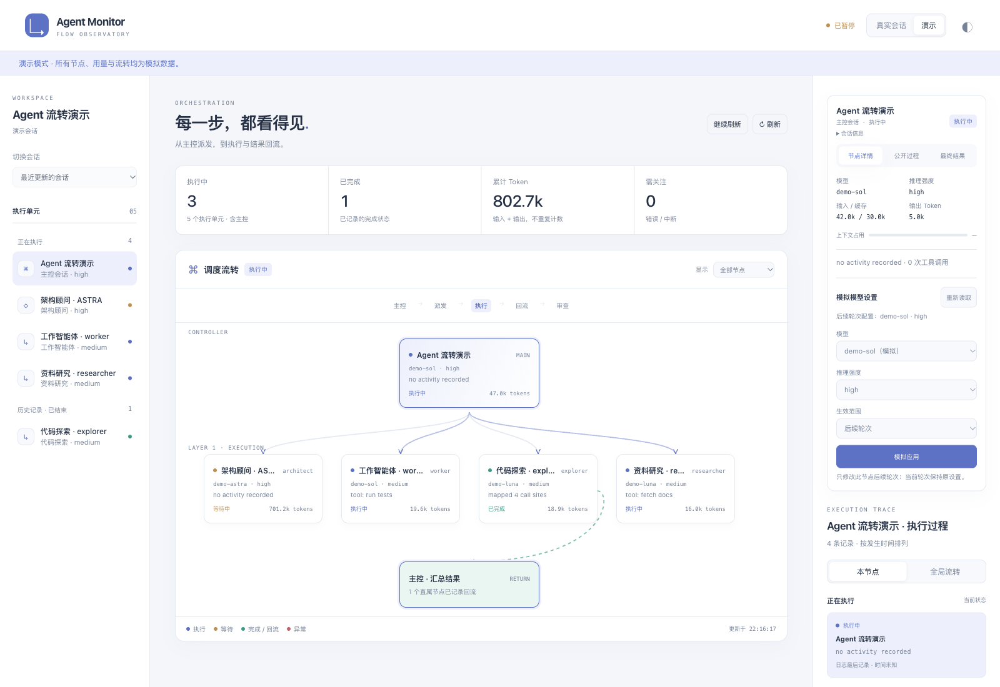
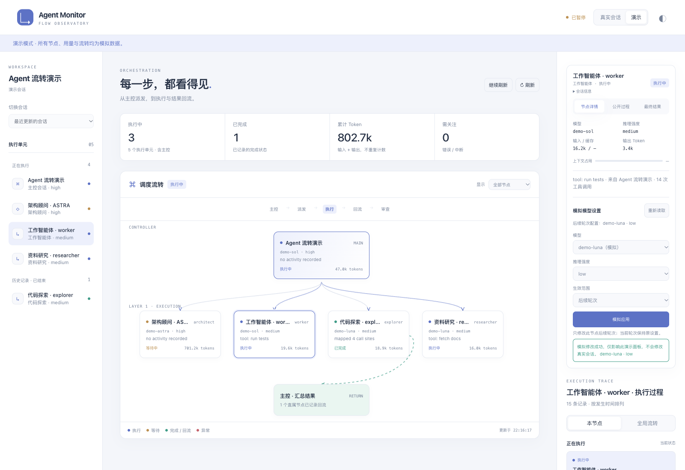
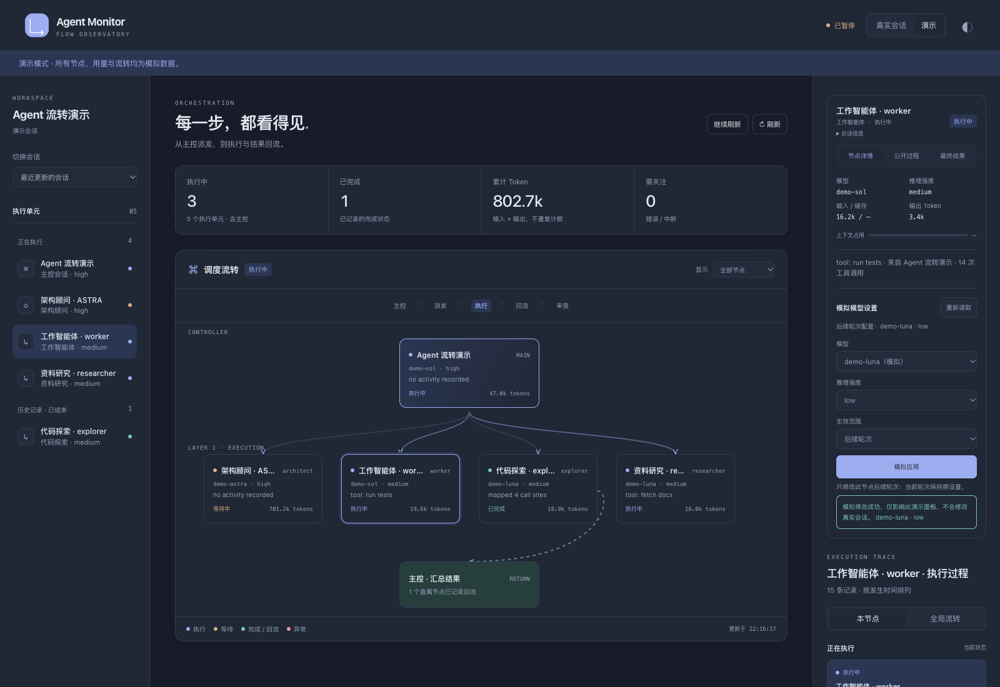
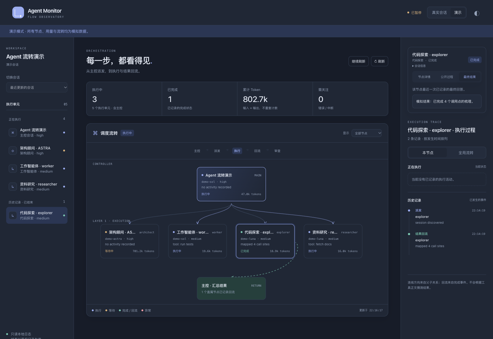

# 界面截图

以下截图来自本项目的本地浏览器预览，均使用演示数据。截图展示监控界面，不代表已验证 Codex 桌面侧边栏入口可见。为便于查看，截图时暂停了自动刷新。

## 全会话中心

默认首页保持未选中状态。左侧目录支持中文标题、会话 ID 和完整项目路径搜索，并按项目和状态筛选。主会话与子会话都能选择；选中后加载该会话的流程树。

下面的会话标题和项目路径来自验收用的模拟日志，未展示真实本机会话。

## 调度流转与节点详情

界面展示主控、子智能体、执行状态和结果回流。左侧分别列出正在执行的节点与已结束的历史节点。

## 节点模型设置

选中节点后可选择模型、推理强度和生效范围。图中执行的是“模拟应用”，不会修改真实会话。真实模型控制要求连接节点所属的 app-server。

## 深色主题

点击右上角主题按钮可切换明暗配色。

## 已完成节点的结果

点击左侧已完成节点，再切换到“最终结果”，查看该节点的公开结果。内部推理正文不会展示。

[安装指南](install.md) · [返回 README](../README.md)
